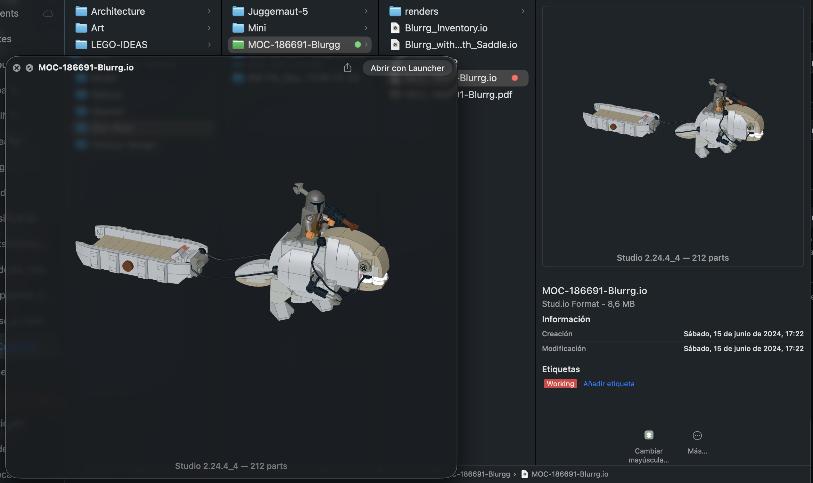

# StudioQL — QuickLook for BrickLink Studio .io Files

A macOS QuickLook plugin that shows thumbnails and previews for BrickLink Studio 2.0 `.io` files directly in Finder and Quick Look.

The .io format is BrickLink Studio's proprietary binary format, storing brick placements, colors, and model configuration. Rendering a meaningful QuickLook preview requires parsing this format and rendering a 3D or at minimum a flat thumbnail. This QL plugin does that. 



## What it does

- **Thumbnails**: Shows the model thumbnail in Finder icon view, column view, and Cover Flow
- **Preview**: Press Space on a `.io` file to see the full model preview with version and part count

## Install binaries

### Installing the Built App

Download the `.zip` file of the release [./release/StudioQL_release.zip] and run the first time the .app. This will register and install the plugins. 

Once the .app is in `/Applications`:

Launch the app at least once — this is mandatory; macOS will not register the extension until the host app has run.

Enable the extension — go to System Settings → Privacy & Security → Extensions → Quick Look and toggle the extension on.

Test it — select a `.io` file in Finder and press Space. 

## Build & Install

```bash
./build_and_install.sh
```

Or build from Xcode with the StudioQL scheme (requires automatic signing with a development team).

### Building from Source (Modern .appex)

#### Prerequisites

Xcode (latest version from the Mac App Store)

Command Line Tools: `xcode-select --install`

Steps
Clone the repo:

```bash
git clone https://github.com/owner/repo.git
cd repo
git submodule update --init --recursive  # if the repo uses submodules
```

Open the Xcode project:

```bash
open *.xcodeproj

```
Set the build target — in Xcode's toolbar, select the main app target (not the .appex sub-target) and choose "My Mac" as the destination.

Handle signing — go to each target → Signing & Capabilities → check "Automatically manage signing" and select your Apple ID team. For repos without a paid Developer account, set the team to your personal free account; this is sufficient for local builds.

Build and run (⌘R or ⌘B) — Xcode compiles the app and the embedded extension together. The .app lands in `~/Library/Developer/Xcode/DerivedData/.../Build/Products/Release/`.

Copy to Applications:

```bash
cp -r ~/Library/Developer/Xcode/DerivedData/.../YourApp.app /Applications/
```

## Requirements

- macOS 12.0+
- Xcode 15+
- Apple Developer account (for code signing the Quick Look extensions)

A critical distinction: Since Mac OS Sequoia (15.0) dropped support for .qlgenerator plugins entirely, any GitHub repo using the old format will not work on Sequoia or later. You need the modern App Extension (.appex) format, where the preview plugin is bundled inside a macOS app. Quicklook extensions are embedded in an accompanying app that install them the first time it is launched. Here I include the StudioQL app for this purpose.

